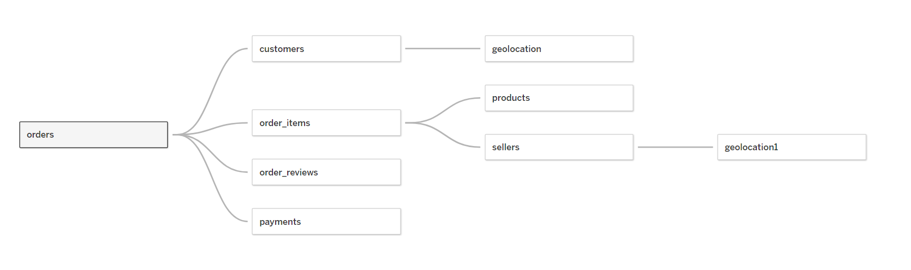

# Target Corporation Analysis

    

Target is a globally renowned brand and a prominent retailer in the United States. Target makes itself a preferred shopping destination by offering outstanding value, inspiration, innovation and an exceptional guest experience that no other retailer can deliver.

This particular business case focuses on the operations of Target in Brazil and provides insightful information about 100,000 orders placed between 2016 and 2018. The dataset offers a comprehensive view of various dimensions including the order status, price, payment and freight performance, customer location, product attributes, and customer reviews.

### Datasets
The data is available in 8 Excel files are:

1. [customer.xlsx](data/customers.xlsx)
2. [geolocation.xlsx](data/geolocation.xlsx)
3. [order_items.xlsx](data/order_items.xlsx)
4. [order_reviews.xlsx](data/order_reviews.xlsx)
5. [orders.xlsx](data/orders.xlsx)
6. [payments.xlsx](data/payments.xlsx)
7. [products.xlsx](data/products.xlsx)
8. [sellers.xlsx](data/sellers.xlsx)

The column decription of each excel file is given below:

- **customers.xlsx**
    - *customer_id*: ID of the consumer who made the purchase.
    - *customer_unique_id*: Unique ID of the consumer
    - *customer_zip_code_prefix*: Zip Code of consumer’s location
    - *customer_city*: Name of the City from where order is made
    - *customer_state*: State Code from where order is made (Eg. São Paulo - SP)

- **gealocation.xlsx**
    - *geolocation_zip_code_prefix*: First 5 digits of Zip Code
    - *geolocation_lat*: Latitude
    - *geolocation_lng*: Longitude
    - *geolocation_city*: City
    - *geolocation_state*: State

- **order_items.xlsx**
    - *order_id*: A Unique ID of order made by the consumers
    - *order_item_id*: A Unique ID given to each item ordered in the order
    - *product_id*: A Unique ID given to each product available on the site
    - *seller_id*: Unique ID of the seller registered in Target
    - *shipping_limit_date*: The date before which the ordered product must be shipped
    - *price*: Actual price of the products ordered
    - *freight_value*: Price rate at which a product is delivered from one point to another

- **order_reviews.xlsx**
    - *review_id*: ID of the review given on the product ordered by the order id
    - *order_id*: A Unique ID of order made by the consumers
    - *review_score*: Review score given by the customer for each order on a scale of 1-5
    - review_comment_title: Title of the review
    - *review_comment_message*: Review comments posted by the consumer for each order
    - *review_creation_date*: Timestamp of the review when it is created
    - *review_answer_timestamp*: Timestamp of the review answered.

- **orders.xlsx**
    - *order_id*:A Unique ID of order made by the consumers
    - *customer_id*: ID of the consumer who made the purchase
    - *order_status*: Status of the order made i.e. delivered, shipped, etc.
    - *order_purchase_timestamp*: Timestamp of the purchase
    - *order_delivered_carrier_date*: Delivery date at which carrier made the delivery
    - *order_delivered_customer_date*: Date at which customer got the product
    - *order_estimated_delivery_date*: Estimated delivery date of the products

- **payments.xlsx**
    - *order_id*: A Unique ID of order made by the consumers
    - *payment_sequential*: Sequences of the payments made in case of EMI
    - *payment_type*: Mode of payment used (Eg. Credit Card)
    - *payment_installments*: Number of installments in case of EMI purchase
    - *payment_value*: Total amount paid for the purchase orde

- **products.xlsx**
    - *product_id*: A Unique identifier for the proposed project
    - *product_category_name*: Name of the product category
    - *product_name_length*: Length of the string which specifies the name given to the products ordered
    - *product_description_length*: Length of the description written for each product ordered on the site
    - *product_photos_qty*: Number of photos of each product ordered available on the shopping portal
    - *product_weight_g*: Weight of the products ordered in grams
    - *product_length_cm*: Length of the products ordered in centimeters
    - *product_height_cm*: Height of the products ordered in centimeters
    - *product_width_cm*: Width of the product ordered in centimeters

- **sallers.xlsx**
    - *seller_id*: Unique ID of the seller registered
    - *seller_zip_code_prefix*: Zip Code of the seller’s location
    - *seller_city*: Name of the City of the seller
    - *seller_state*: State Code (Eg. São Paulo - SP)

#### Dataset Schema:

### Technologies used:
 * `Python`
 * `SQL Server Management Studio`
 * `Tableau`

**Dashboard:**

## Problem statement
Analyze the given dataset to extract valuable insights and provide actionable recommendations.

##### Insights:
- There were total of 99,441 customers.
- There were 96,096 unique customer id.
- The customers were from 4,119 different cities of 27 states of Brazil.
- 68.65% of customers were from Southeastern region of Brazil. 14.23% were from South and the remaining from other regions.
- *São Paulo* has the highest number of customers(41,746) in the country. Followed by *Rio de Janeiro* (12,852).
- *Roraima* state has the least number of customers (46) in the country, followed by Amapá (68).
- The data of 3095 sellers were available.
- 73.89% of sellers reside in Southeastern region of Brazil.
- Sellers resides in 611 cities of 23 cities of Brazil.
- *Sao Paulo* city has the most number of sellers (694). Followed by *Curitiba*.
- Order dataset contains the data of 25 months with first item purchased on `2016-09-04 21:15:19` and last order delivered on `2018-10-17 13:22:46`.
- The average time taken to approve order is `10:25:08`. 
- The average time taken for the order to reach carrier is `2 days 19:19:15`.
- The average time taken to deliver the order is `12 days 13:24:31`.
- Their were `96478` orders *delivered*, `1107` orders *shipped*, `625` orders *cancelled*, and `609` *unavailable* oreds.
- `32211` orders were purchased in *Afternoon (12:00-17:00)*. Followed by `30311` in *Evening (17:00-22:00)*, `22906` in Morning (3:00-12:00) and `14013` in *Night (22:00-3:00)*.
- In the 25 months period, `88649` orders were delivered before estimated time, `1292` were delivered on the estimated time, and `6535` were delayed.
